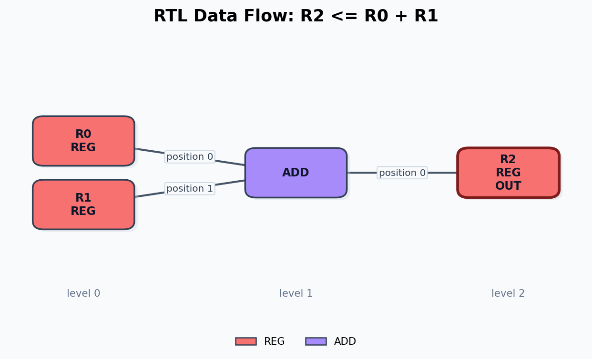

# Circuit Modality Computational Graph Examples

Each image shows how one circuit representation can be viewed as an ordered computational graph.

## `aig_not_a_and_b`

## `pm_inv_nand2`

## `rtl_register_wire_update`

