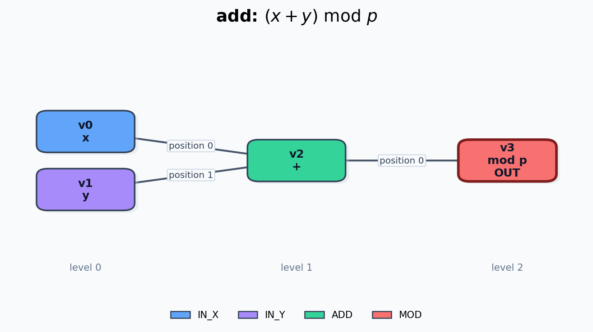
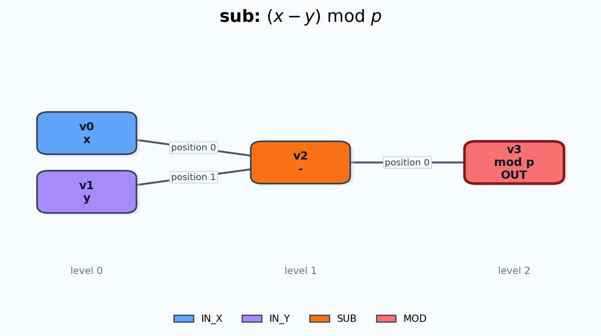
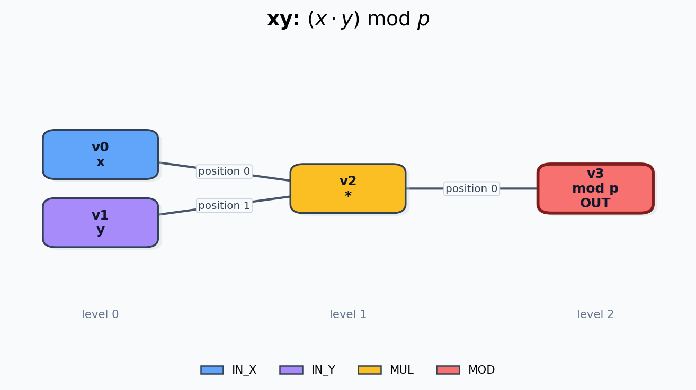
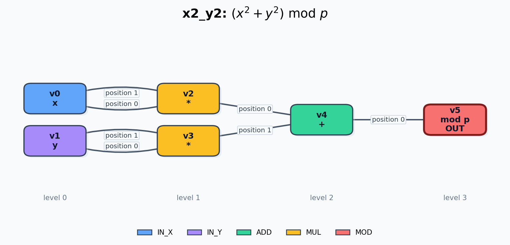
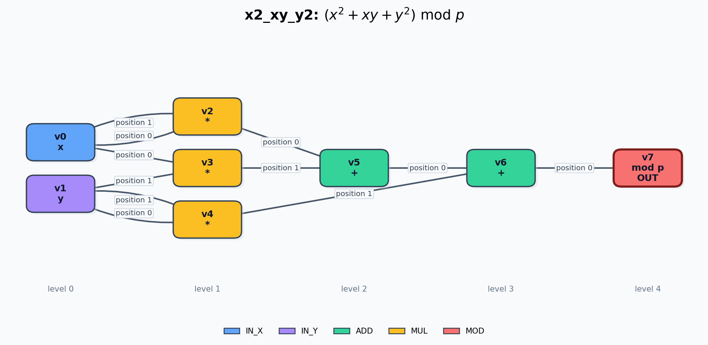
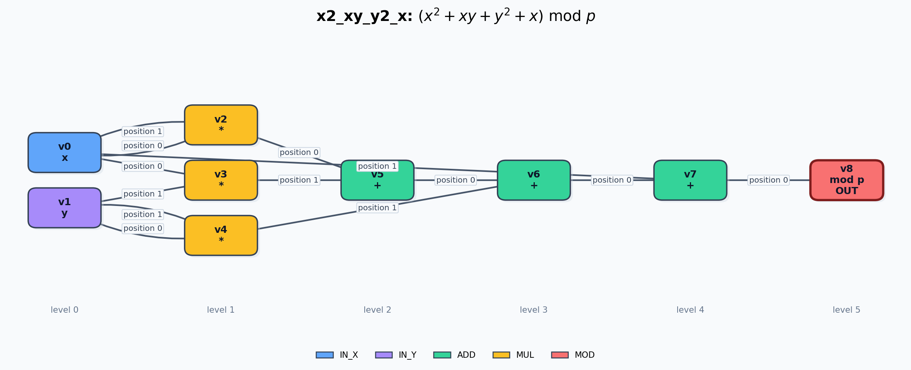
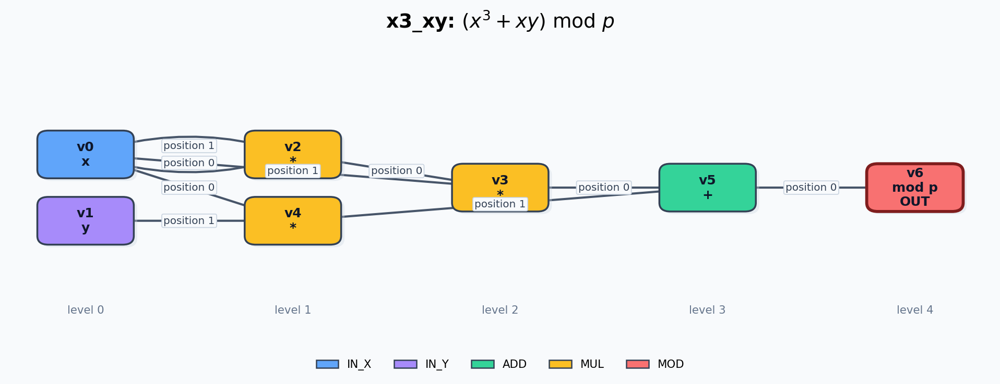
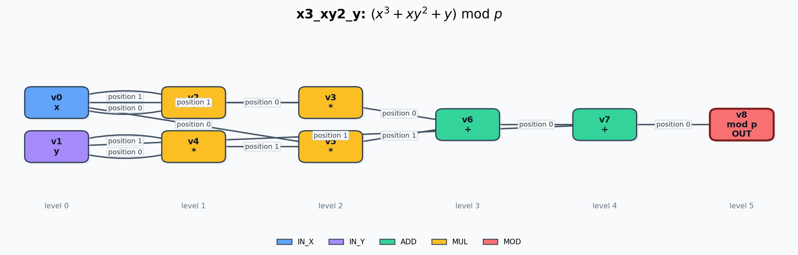

# Computational Graph DAG Visualizations

Each expression is rendered as an independent directed acyclic graph. Edge labels mark ordered operator inputs.

## `add`

- PNG: `add.png`

## `sub`

- PNG: `sub.png`

## `xy`

- PNG: `xy.png`

## `x2_y2`

- PNG: `x2_y2.png`

## `x2_xy_y2`

- PNG: `x2_xy_y2.png`

## `x2_xy_y2_x`

- PNG: `x2_xy_y2_x.png`

## `x3_xy`

- PNG: `x3_xy.png`

## `x3_xy2_y`

- PNG: `x3_xy2_y.png`
